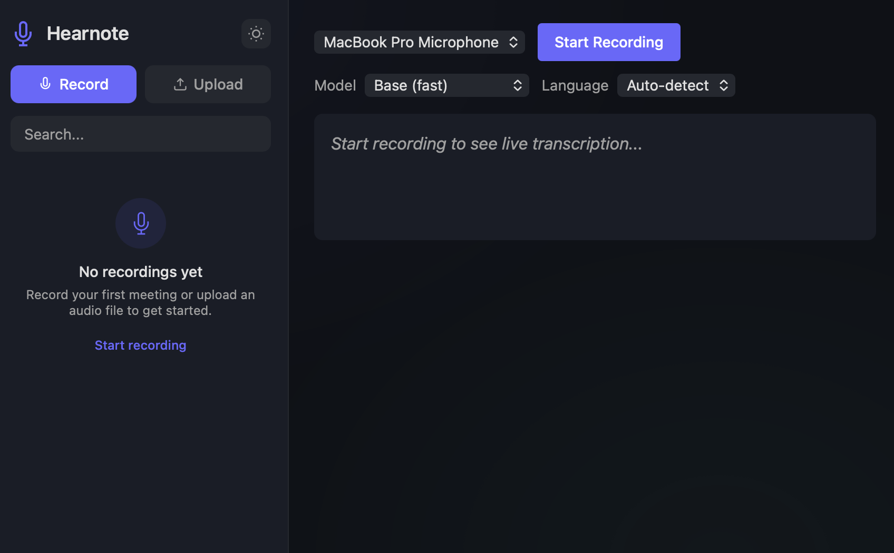

# Hearnote

**Local-first meeting transcription — nothing leaves your machine.**

Record live audio or drop in a file. Whisper transcribes it on your hardware. Get searchable, timestamped transcripts with AI-powered summaries — all running locally.



## Why Hearnote

- **100% private** — audio and transcripts stay on your machine, period
- **Real-time** — see words appear as you speak, with a live waveform visualizer
- **No subscriptions** — runs on open-source models, no API keys needed
- **Works offline** — no internet required after initial setup

## Features

| Feature | Description |
|---------|-------------|
| Live recording | Transcribe from mic or system audio (BlackHole) in real-time |
| File upload | Drag in audio/video — streaming progress with cancel support |
| AI summaries | One-click summaries via Ollama (local) or copy prompt for any AI |
| Transcript history | Searchable sidebar, pin favorites, click-to-seek playback |
| Export | Download as .txt, .srt, .vtt, or copy as Markdown |
| Multi-language | 13 languages + auto-detect |
| Model selection | Fast / Balanced / Accurate — trade speed for precision |
| Re-transcribe | Re-process recordings with different settings |
| Dark & light themes | Toggle in the sidebar |
| URL routing | Shareable links to specific transcripts |

## Quick Start

```bash
# Install Python dependencies
uv sync

# Install frontend & build
cd frontend && npm install && npm run build && cd ..

# Run
uv run python app.py
```

Open **http://localhost:8000**

## Development

```bash
cd frontend && npm install   # first time only
./dev.sh                     # starts backend + frontend with hot-reload
./dev.sh --open              # same, opens browser
```

- **Backend** → http://localhost:8000 (FastAPI, auto-restarts on changes)
- **Frontend** → http://localhost:5173 (Vite, React HMR, proxies API/WS to backend)

### Production build

```bash
cd frontend && npm run build
```

Outputs to `static/`, served by FastAPI at http://localhost:8000.

### VS Code

The repo includes `.vscode/launch.json` with debug configurations:
- **Full Stack** — launches backend + frontend together
- **Chrome: Frontend** — attaches debugger with source maps

## Tech Stack

- **Backend**: Python, FastAPI, faster-whisper, WebSockets
- **Frontend**: React 19, TypeScript, Vite, Tailwind CSS v4
- **AI**: Whisper (transcription), Ollama/llama3 (summarization)
- **Zero cloud dependencies** — everything runs locally

## AI Summarization

### Option 1: Local with Ollama (fully private)

```bash
brew install ollama
ollama serve
ollama pull llama3
```

Click **Summarize** in any transcript — generated entirely on your machine.

### Option 2: External AI

If Ollama isn't available, the prompt is automatically copied to your clipboard. Paste it into ChatGPT, Claude, Copilot, or any AI chat.

## System Audio Capture (Teams/Zoom/Meet)

To transcribe meeting audio on macOS, route system audio through [BlackHole](https://github.com/ExistentialAudio/BlackHole):

1. `brew install blackhole-2ch`
2. Open **Audio MIDI Setup** → Create Multi-Output Device (your speakers + BlackHole 2ch)
3. Set the Multi-Output Device as system output
4. In Hearnote, select **BlackHole 2ch** as input

Full troubleshooting guide in the [wiki](https://github.com/papesce/hearnote/wiki) or see the detailed setup below.

<details>
<summary>Detailed BlackHole setup</summary>

### Create a Multi-Output Device

1. Open **Audio MIDI Setup** (Spotlight → "Audio MIDI Setup")
2. Click **+** → **Create Multi-Output Device**
3. Check both your regular output and **BlackHole 2ch**
4. Ensure your regular output is first (drag to reorder)
5. Rename to "Hearnote Output" (optional)

### Set as system output

System Settings → Sound → Output → select Multi-Output Device

### Troubleshooting

| Problem | Fix |
|---------|-----|
| BlackHole not in Audio MIDI Setup | Restart Mac after install |
| No audio captured | Verify Multi-Output Device is system output |
| Can't hear audio | Check speakers are in Multi-Output Device |
| Meeting app ignores system output | Set output in Zoom/Teams audio settings |

### Reverting

System Settings → Sound → Output → select your regular speakers.

</details>

## Requirements

- Python 3.10+
- Node.js 18+ (for frontend build)
- macOS (Intel or Apple Silicon)
- Ollama (optional, for local AI summaries)

## License

[MIT](LICENSE)
